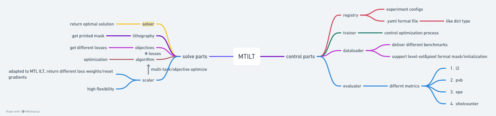
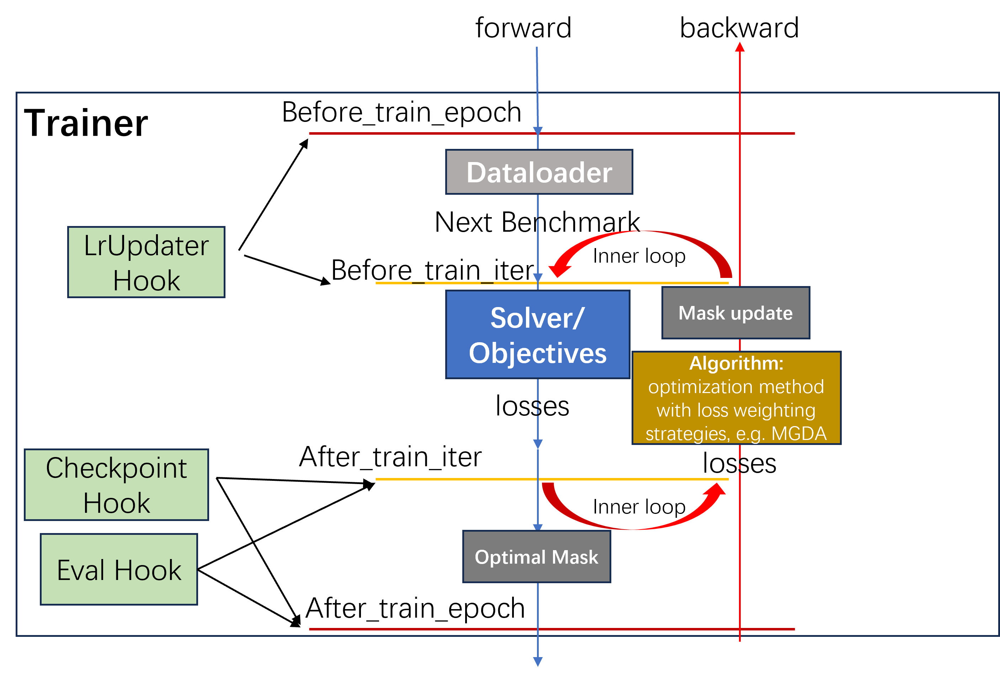

# Introduction

`PVILT` is an open-source library for inverse lithography technology (ILT) research, adapting to multi-tak/objectives optimization algorithms. This library has the following three characteristics.

* **Simple**: ... (follow hierarchical abstract, easy to read code)
* **Unified**: ... (unified code base to implement)
* **Comprehensive**: ... (supports different initialization methods and MTL algorithms)
* **Extensive**: ...(modular design principles)

## Overall Framework

`MTILT` supports a unified framework for solving masks while accommodating a variety of multi-task/objective optimization algorithms to optimize multiple loss functions. The overall framework consists of several modules introduced below.

* The [Registry](../mtilt/utils/registry.py) module is a key component for implementing modular design. When used as a decorator on various class definitions and combined with user-defined configurations, it allows class instantiation in a specified and simple string format.
* The [Dataloader](../mtilt/data/build.py) module is responsible for benchmark/data pre-processing and loading. It just supports map-style Pytorch dataset, and it returns only one design during each iteration.
* The [Trainer](../mtilt/engine/defaults.py#L171) module is responsible for all modular definitions and packaging required for the task flow, such as the `lithography` model, the `initializer` (i.e., PixelInitializer or LevelSetInitializer), basic training settings (e.g., learning rate, random seed), and more. It also handles the sampling of design instances required for optimization.
* The [solver](../mtilt/solving/solver/solver.py) module is the core component of this codebase. As an atomic task solver, it takes the `design` instance passed by the `Trainer` as input and pairs it with pre-defined solving modules to optimize the instance, such as `objectives` and `lithography` models. It then internally solves the task and returns the optimized mask obtained.
* The [lithography](../mtilt/solving/litho_operator/build.py) module defines various lithography model properties and parameters, requiring the determination of certain basic parameters, e.g., `kernel` and `print_steepness`.
* The [objectives](../mtilt/solving/objectives/build.py) module centrally manages the objective functions involved in ILT tasks. Internally, it calls and computes the objective functions in dictionary form and ultimately returns the loss value corresponding to each objective function. This value will serve as input to the subsequent `algorithm` module.
* The [algorithm](../mtilt/solving/algorithms/build.py) module supports both standard optimizer-based solving and various multi-task/objective optimization algorithms. It jointly optimizes individual or multiple objectives using PyTorch's internal [autograd](https://pytorch.org/tutorials/beginner/blitz/autograd_tutorial.html?highlight=autograd).

## Hierarchical Abstract

As shown in the diagram below, `MTILT` employs a functionally independent modular hierarchical design. It instantiates each module registered in the `Registry` using low-level configurations and controls the basic workflow through the `Trainer`, allowing upper-level modules to focus on their individual functionalities and collaborate to obtain the optimal mask.

## Program Running Logic

