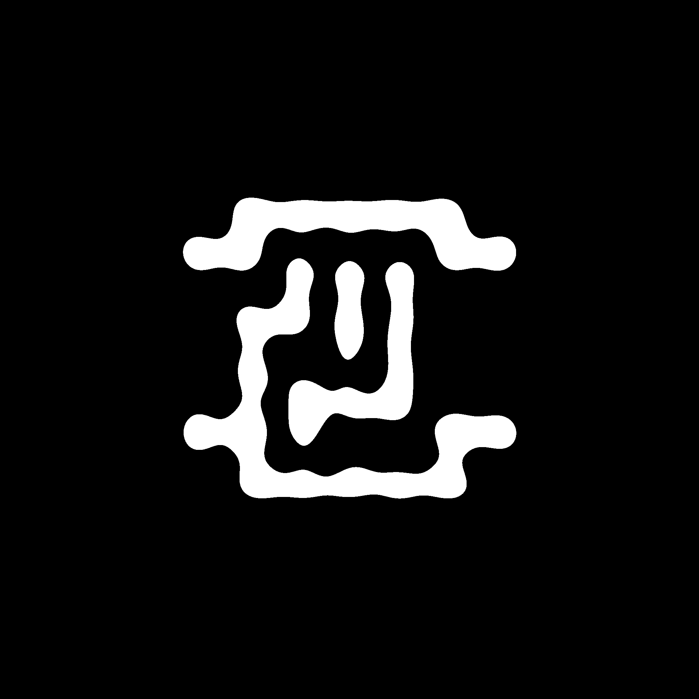
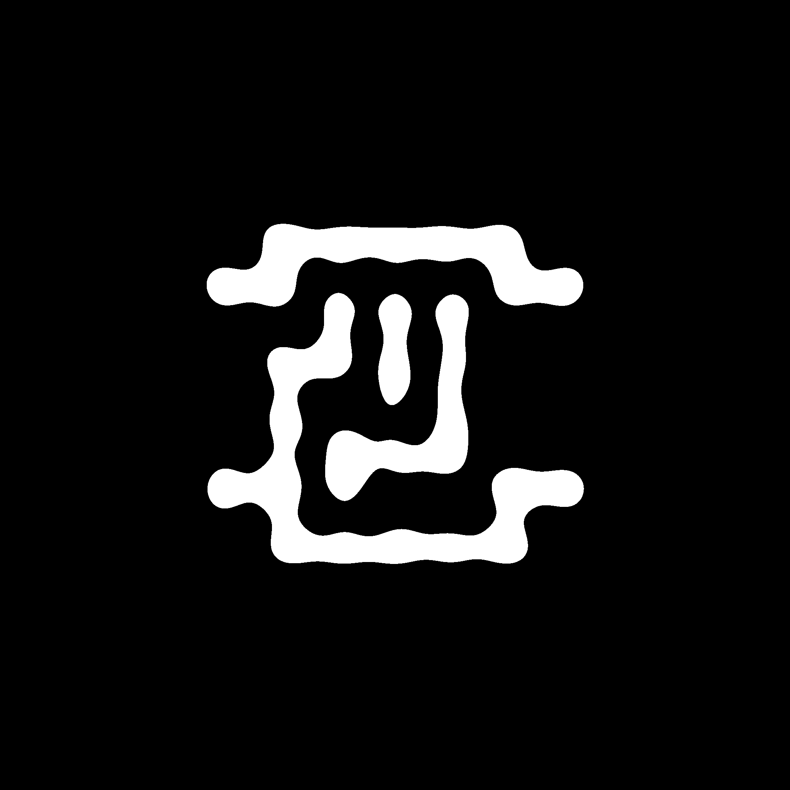

# MTILT

`MTILT` is an open-source library built on [detectron2](https://detectron2.readthedocs.io/en/latest/index.html) and [OpenILT](https://github.com/OpenOPC/OpenILT/tree/main) for inverse lithography technology (ILT) research. Apart from the basic ILT optimization, this library also comes equipped with various multi-objectives optimization (MOO) methods. For more details, please refer to [Introductions](introductions.md) and [API instructions](API_Documentation.md). To better understand and use this repo code, we recommend you refer to the [file description](structure.md).  

## Installation

### Install basic dependencies

1. First you should create a new environment with

```shell
conda create -n mtlilt python==3.8
conda activate mtlilt
```

2. install Pytorch, torchvision and torchaudio packages. Environment with torch==1.8.0, torchvision==0.9.0, with cuda==12.0 is tested:
```shell
pip install torch==1.8.0+cu111 torchvision==0.9.0+cu111 torchaudio==0.8.0 -f https://download.pytorch.org/whl/torch_stable.html
```

You may install other torch version packages, but there may be some unknown bugs.

3. Then, you need to install the dependencies with pip with
```shell
pip install -r requirements.txt
```

### Install adaptive_boxes

The python package adaptive-boxes is needed for shot counting. You can install the package in the thirdparty/adaptive-boxes folder.

```shell
cd thirdparty/adaptive-boxes
pip install -e .
```


## Quick Start

We maintain consistency with [detectron2](https://detectron2.readthedocs.io/en/latest/index.html) for all the basic operations, and you can refer to its [tutorial](https://detectron2.readthedocs.io/en/latest/tutorials/getting_started.html). Below, we provide a simple workflow to obtain the optimized mask.

### Optimize mask


We follow a *one-vs-one* styled process, as exemplified by the 'One configuration file--vs--One ILT experiment'. If not necessary, there is no need for you to understand or modify the source code. You can simply create your own configuration file based on your requirements or use a predefined one. Then, with a single click run, you can obtain the optimized mask. The following provides a simple example to explain the usage of the configuration file. If you want to learn more about the configuration file, please refer to [Config-README](config.md).

1. Chose a pre-defined configuration file, for example, 
[`base_simple_ilt_2048.yaml`](configs/ICCAD2013/base_simple_ilt_2048.yaml). 

2. run:
```shell
cd project_root
CUDA_VISIBLE_DEVICES=0 python tools/solve.py \
      --config-file configs/ICCAD2013/base_simple_ilt_2048.yaml \
      OUTPUT_DIR exps/simpleilt_2048
```

### Chose Smit litho simulator

This repository contains two lithography simulators, namely [ICCAD13](./mtilt/solving/litho_operator/generalized_litho_operator.py#L190) and [GWX](../mtilt/solving/litho_operator/smit_litho_operator.py). The default simulator is the former. You can choose to switch between the two simulators to complete ILT tasks. The following explains how to switch to the GWX SMIT simulator (in fact, due to current simulator version issues, the current code version cannot correctly integrate the simulator into the ILT process, but you can test some basic scripts).

1. Before running programs, you need to modify the corresponding environment variables (try to keep your Python version as 3.8.0 and PyTorch version as 1.8.0, otherwise there may be unknown errors in the environment)::
```shell
export LD_LIBRARY_PATH="/data/share/eda/lithosim/smit/lib:/data/share/eda/lithosim/smit/release_dependence/py38conda/lib:$LD_LIBRARY_PATH"
export PYTHONPATH="/data/share/eda/lithosim/smit/pylib/core:$PYTHONPATH"
export SMITLMD_LICENSE_FILE=55613@localhost.localdomain
```

2. Run the basic script for testing the SMIT simulator.
For this test part, please refer to [README](../mtilt/solving/litho_operator/smit/README.md)


## Experiments

These experiments are conducted on NVIDIA GeForce RTX3090. All results are evaluated with a resolution of 2048 x 2048. 
Only the center 1024 x 1024 pixels are valid.

### Baseline ILT method
|   Testcase   | L2 loss | PVBand | EPE     |  Shots  |
|--------------|---------|--------|---------|---------|
| M1_test1     | 16398   | 26357  | 2       |  -1    |
| M1_test2     | 48904   | 54895  | 8       |  -1    |
| M1_test3     | 8960   | 19867  | 0       |  -1    |
| M1_test4     | 14295   | 24282  | 1       |  -1    |
| M1_test5     | 80872  | 87299  | 47      |  -1    |
| M1_test6     | 36704   | 52575  | 0       |  -1    |
| M1_test7     | 37338   | 46013  | 4       |  -1    |
| M1_test8     | 37789   | 57491  | 0       |  -1    |
| M1_test9     | 29511   | 47598  | 2       |  -1    |
| M1_test10    | 47364   | 64915  | 2       |  -1    |
| Average      | 35814   | 48129  | **6.6** |  -1    |

### + MOO ([DB](configs/ICCAD2013/simple_ilt_2048_DB.yaml))
|   Testcase   | L2 loss   | PVBand    | EPE |  Shots  |
|--------------|-----------|-----------|-----|---------|
| M1_test1     | 15529     | 25573     | 2   |  -1    |
| M1_test2     | 49615     | 55446     | 9   |  -1    |
| M1_test3     | 8856      | 19970     | 0   |  -1    |
| M1_test4     | 13881     | 24018     | 1   |  -1    |
| M1_test5     | 82353     | 85542     | 52  |  -1    |
| M1_test6     | 36943     | 52848     | 0   |  -1    |
| M1_test7     | 37093     | 47078     | 3   |  -1    |
| M1_test8     | 38211     | 56714     | 2   |  -1    |
| M1_test9     | 27730     | 48771     | 2   |  -1    |
| M1_test10    | 45660     | 63592     | 2   |  -1    |
| Average      | **35587** | **47955** | 7.2 |  -1    |


## Examples

### Baseline ILT method

<div align="center">

</div>

### + MOO ([DB](configs/ICCAD2013/simple_ilt_2048_DB.yaml))

<div align="center">

</div>


## Future Work

1. ~~integrate smit simulator into ILT process~~.
2. evaluation metrics, e.g., NILS, ~~process window~~.
3. visualization of different metrics, e.g., process window.

## Acknowledgements

* Base code is borrowed from [OpenILT repo](https://github.com/OpenOPC/OpenILT/tree/main)
* The basic framework refers to [Detectron2](https://detectron2.readthedocs.io/en/latest/index.html), since such platform with modular design is flexible and extensible. 