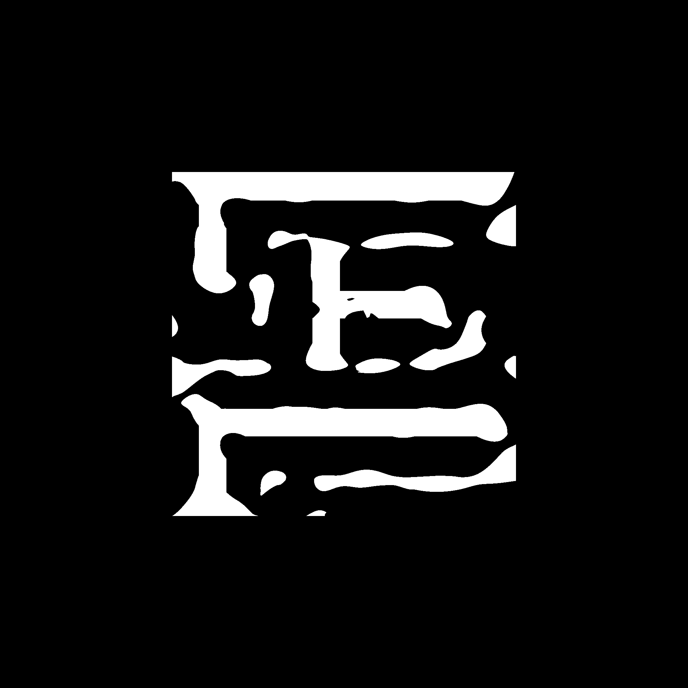

```text
   ____                        ____ __   ______
  / __ \ ____   ___   ____    /  _// /  /_  __/
 / / / // __ \ / _ \ / __ \   / / / /    / /   
/ /_/ // /_/ //  __// / / / _/ / / /___ / /    
\____// .___/ \___//_/ /_/ /___//_____//_/     
     /_/                                           
```

# OpenILT: An Open-source Platform for Inverse Lithography Technology Research

OpenILT is a open-source platform for inverse lithography technology (ILT) research. It has a comprehensive and flexible ecosystem of libraries that enable the efficient development and evaluation of ILT algorithm. OpenILT decouples the ILT flow into different components, lithography simulation, initialization, optimization, and evaluation. ILT researchers can implement and evaluate their ideas quickly by replacing a component with the novel method. Moreover, the platform is implemented with *pytorch*, which enables easy GPU acceleration and deep-learning integration. 

##


## Installation

### Install Basic Dependencies

If you manage your python environments with anaconda, you can create a new environment with
```bash
conda create -n openilt python=3.8
conda activate openilt
```
To install the dependencies with pip, you can use
```bash
pip3 install -r requirements_pip.txt
```

You may install the dependencies with conda:
```bash
conda install --file requirements_conda.txt -c pytorch -c conda-forge
```
However, due to the complex environment solving, the process may be slow and the installed packages may be unsatisfactory. 
For example, you may get a CPU version of pytorch. 
Thus, if you want to use conda, you may install a GPU version of pytorch before you install other dependencies. 

Note that we develop OpenILT with python 3.8 and pytorch 1.10. 
We also tested OpenILT with pytorch 2.0. 
The system we use is Ubuntu 18 with Intel Xeon CPUs and NVIDIA GPUs. We also tested the program on CentOS 7. 

### Install adaptive-boxes

The python package *adaptive-boxes* is needed for shot counting. 
You can install the package in the *thirdparty/adaptive-boxes* folder. 
```
cd thirdparty/adaptive-boxes
pip3 install -e .
```

### Run ILT algorithms

You can test the ILT methods in OpenILT with the following commands: 

*SimpleILT*
```
python3 pyilt/simpleilt.py
```

The final mask images will be saved in tmp/. 

### Possible issues

#### The code runs slowly

You are probably using the CPU version of pytorch. 
Please install a GPU version of pytorch.  

In addition, the shot counting process is quite slow if the pattern is complex. 
Thus, you may delete the shot counting to make it faster. 

```
shot = 0 # shotCount.run(bestMask, shape=(512, 512))
```

#### 'builtin_function_or_method' object has not attribute 'fft2'

Please use pytorch>=1.8.0.  

#### mode() got an unexpected keyword argument 'keepdims'

Please use scipy>=1.9.0.

#### Error \#15: Initializing libiomp5.dylib, but found libiomp5.dylib already initialized

You may add the following code at the beginning of the python file. 

```
import os
os.environ['KMP_DUPLICATE_LIB_OK']='True'
```


##

## Background

Over the past few decades, the feature size of the integrated circuit has been continuously shrinking in accordance with Moore’s Law. 
As a result, it becomes more and more challenging to acquire high pattern fidelity and mask printability due to the non-neglectable lithography proximity effect. 
Moreover, the printed wafer image becomes highly sensitive to minor variations of the lithography conditions. 

Inverse Lithography Technology (ILT) as an important OPC method, treating the mask optimization as an inverse problem of the imaging system. 
It aims at optimizing the carefully designed objective function and adjusting the pixel-wise mask backwards. 
A variety of attempts have been made in ILT to improve both the printed pattern fidelity and the process robustness.
Representative works on ILT include: 

(1) Numerical methods: MOSAIC [1], GPU-LevelSet [2,3], CTM-SRAF [4], etc. 

(2) GAN-OPC [5,6], Neural-ILT [7,8], DAMO [9,10], Devel-Set [11], etc. 

##


## Motivation

ILT is an active reserach field where various works are published every year. 
Although there exist a popular ICCAD13 benchmark [0] and widely adopted metrics like L2 loss, EPE, PVBand, shots, runtime, etc., we are in lack of a common platform that can support the fast development and evaluation of ILT methods under specified settings. 

##


## Preliminaries

### Lithography simulation flow
```text
               Optical projection model                   Photoresist model
Mask image  -----------------------------> Aerial image ----------------------> Printed image 
```

### Inverse lithography technology flow
```text
             Transformation                   Optical projection model                   Photoresist model
Parameters ------------------> Mask image  -----------------------------> Aerial image ----------------------> Printed image 
    ^                                                                                                             | 
    | Update                                                                                                      | Minimize distance
    |                                        Back-propagation                                                     | 
Gradient <---------------------------------------------------------------------------------------------------- Target image 
```

### Terminologies

**Lithography model**: include the optical projection model and photoresist model.

**Optical projection model**: the Hopskins diffraction model used to simulate a partially coherent imaging system. 

**Photoresist model**: a sigmoid function that simulates development and etching. 

**Mask image**: the input image to the lithography process. 

**Aerial image**: the image after the optical projection simulation. 

**Printed image**: the image after the photoresist process simulation, which represents the image printed onto the wafer. 

**Target image**: the binary image that represents what an ideal printed image should be. 

**PVBand**: Process variability band (PVBand) measures the layout sensitivity to process variations, which indicates a range of feature edge placement among possible lithography process variations.

**EPE**: Edge placement error (EPE) measures the manufacturing distortion by the difference of edge placement between the final image and the target image under nominal process condition.

##


## Modules

### Lithography Simulation

We provide two lithography simulator in *pylitho/exact.py* and *pylitho/simple.py*. 
Both of them implements the lithography models provided by ICCAD13 benchmark [0]. 
*pylitho/simple.py* implements the speedup technique in [1] that combines the kernels together in the back-propagation step, $\sum_i w_i (M \otimes h_i) = M \otimes \sum_i (w_i h_i)$, where $M$ is the mask image and $h_i$ is a kernel in the Hopskins diffraction model. 

#### class: *LithoSim*

Both *pylitho/exact.py* and *pylitho/simple.py* provide the *LithoSim* class, which is also a *torch.nn.Module*. We can simlulate the lithography with the Hopskins diffraction model by calling: 
```python
printedNom, printedMax, printedMin = self._lithosim(mask)
```
*printedNom*, *printedMax*, *printedMin* are the simulated printed image at the *nomial*, *maximum*, and *minimum* process corners, respectively. 

#### Implementing a new lithography simulator

We can design a new lithography simulator by implementing a *pytorch Module* with a forward function. 


### Initialization Method

We usually use *glp* files or binary images as the inputs of ILT algorithms. 
Thus, an initializer is needed to generate the target image and the initial parameters. 
We can get the target and parameters with some code similar with: 
```python
initalizer = Initializer()
target, params = initalizer.run(design, sizeX, sizeY, offsetX, offsetY)
```
The argument *design* may be a *glp* file or a image file. 
The image size if $sizeX \times sizeY$. 
The point coordinates have an offset $(offsetX, offsetY)$ from the original ones. 

We provide two basic initializers, *PlainInit*, *PixelInit*, in the file pyilt/initializer.py. 

#### *PlainInit*

Convert *glp* file to the target image, and set *params = target*

#### *PixelInit*

Convert *glp* file to the target image, and set *params = 2 * target - 1*

#### *glp* file example
```text 
CELL 0OBAN_SAIL PRIME
    PGON N M1 128 479 341 479 341 214 129 214 129 128 409 128 409 565 128 565
    RECT N M1 568 180 90 304
    PGON N M1 586 566 727 566 727 475 795 475 795 653 586 653
    PGON N M1 128 654 505 654 505 897 862 897 862 128 1097 128 1097 214 930 214 930 654 1097 654 1097 740 930 740 930 978 437 978 437 740 128 740
ENDMSG
```
PGON and RECT are rectilinear polygon and rectangle shapes, respectively. 
RECT is represented by *x, y* and *x_offset, y_offset*. 
PGON is represented by a sequence of points. 


### ILT Method

We provide a typical ILT method, *SimpleILT*, with GPU acceleration support for faster optimization. 
We use SGD optimizer from pytorch to do gradient descent. 
Other builtin optimizers in pytorch or new optimizers can also be adopted.   

#### *SimpleILT* (pyilt/simpleilt.py)

It implements a simplified version of *MOSAIC* [1] without the EPE loss and gradient scaling tricks. 
It minimizes the L2 loss and the PVBand loss. 
We denote the printed images at nominal, maximum, minimum corners with $Z_{nom}$, $Z_{max}$, and $Z_{min}$. 
The target image is represented by $Z_T$.
L2 loss is defined as $\Vert Z_{nom} - Z_T \Vert^2_2$. 
PVBand loss is defined as $\Vert Z_{max} - Z_T \Vert^2_2 + \Vert Z_{min} - Z_T \Vert^2_2$. 
We can also optimize multiple masks concurrently on multiple GPUs. 

To use SimpleILT, we should prepare the lithography simulator with: 
```python
litho = lithosim.LithoSim("./config/lithosimple.txt")
```
Then instantiate a *SimpleILT* solver with: 
```python
cfg = SimpleCfg("./config/simpleilt2048.txt")
solver = SimpleILT(cfg, litho)
```
The testcase can be loaded via: 
```python
SCALE = 1 # downsampling scale in the optimization
design = glp.Design(f"./benchmark/ICCAD2013/M1_test{idx}.glp", down=SCALE)
design.center(cfg["TileSizeX"], cfg["TileSizeY"], cfg["OffsetX"], cfg["OffsetY"])
target, params = initializer.PixelInit().run(design, cfg["TileSizeX"], cfg["TileSizeY"], cfg["OffsetX"], cfg["OffsetY"])
```
Then we can all the solver to get an optimized mask image. 
```python
l2, pvb, bestParams, bestMask = solver.solve(target, params)
```

### Evaluation

The evaluation code is in pyilt/evaluation.py. We provide three classes for evaluation, *Basic*, *EPEChecker*, *ShotCounter*. 
To evaluate the L2 loss $\Vert Z_{nom} - Z_T \Vert_2^2$ and PV Band $\Vert Z_{max} - Z_{min} \Vert_2^2$, we can use the *Basic* by: 
```python
test = evaluation.Basic(litho, 0.5) # litho is the lithography simulator
l2, pvb = test.run(mask, target, scale=SCALE) # SCALE is the scaling factor 
```

The interfaces of *EPEChecker* and *ShotCounter* are similar to *Basic*. 
*EPEChecker* estimates the EPE and *ShotCounter* count the shots (rectangles) with adaptive rectangular decomposition (ARD). 
Note that *ShotCounter* runs slowly. Thus, we may not usually call shot counting. 
We can eliminate the shot counting when we need a fast evaluation. 

*EPEChecker* example: 
```python
epeCheck = EPEChecker(litho, 0.5)
epeIn, epeOut = epeCheck.run(mask, target, scale=1)
epe = epeIn + epeOut
```

*ShotCounter* example: 
```python
shotCount = ShotCounter(litho, 0.5)
shot = shotCount.run(mask, shape=(512, 512)) 
```

We can also directly run pyilt/evaluation.py to evaluate ILT results by: 
```bash
python3 pyilt/evaluation.py <target glp/image> <mask image>
```


## Experiments

These experiments are conduced on RTX3090. 
All results are evaluated with a resolution of $2048 \times 2048$. 
Only the center $1024 \times 1024$ pixels are valid. 
This setting is more challenging than the settings in some existing works. 

### *SimpleILT* (Average runtime 2.26s)

|   Testcase   |  L2 loss  |  PVBand  |  EPE  |  Shots  |
|--------------|-----------|----------|-------|---------|
| M1_test1     |  43408    |  52281   |  3    |  723    |
| M1_test2     |  35326    |  41865   |  2    |  623    |
| M1_test3     |  75428    |  78805   | 43    |  873    |
| M1_test4     |  13649    |  22112   |  2    |  781    |
| M1_test5     |  37330    |  54977   |  2    |  604    |
| M1_test6     |  35711    |  51036   |  0    |  659    |
| M1_test7     |  29566    |  44576   |  0    |  555    |
| M1_test8     |  14327    |  20727   |  0    |  876    |
| M1_test9     |  45347    |  64063   |  0    |  617    |
| M1_test10    |   8404    |  16685   |  0    |  809    |
| Average      |  33850    |  44713   |  5.2  |  712    |


## Future Work

#### Integrate deep-learning-based methods into OpenILT

#### Design better methods

#### Improve the functionalities and interfaces of the platform


## Examples

### M1_test7

#### Target Image 


#### *SimpleILT*



### M1_test10

#### Target Image 


#### *SimpleILT*


## Reference

[0] Banerjee, Shayak, Zhuo Li, and Sani R. Nassif. "ICCAD-2013 CAD contest in mask optimization and benchmark suite." 2013 IEEE/ACM International Conference on Computer-Aided Design (ICCAD). IEEE, 2013.

[1] Jhih-Rong Gao, Xiaoqing Xu, Bei Yu, David Z. Pan, “MOSAIC: Mask Optimizing Solution With Process Window Aware Inverse Correction”, ACM/IEEE Design Automation Conference (DAC), pp. 52:1–52:6, San Francisco, June 1–5, 2014. 

[2] Ziyang Yu, Guojin Chen, Yuzhe Ma, Bei Yu, “A GPU-enabled Level-Set Method for Mask Optimization”, IEEE/ACM Proceedings Design, Automation and Test in Europe (DATE), Feb. 01–05, 2021. 

[3] Ziyang Yu, Guojin Chen, Yuzhe Ma, Bei Yu, “A GPU-enabled Level Set Method for Mask Optimization”, IEEE Transactions on Computer-Aided Design of Integrated Circuits and Systems (TCAD), vol. 42, no. 02, pp. 594–605, 2023. 

[4] Ziyang Yu, Peiyu Liao, Yuzhe Ma, Bei Yu, Martin D.F. Wong, “CTM-SRAF: Continuous Transmission Mask-based Constraint-aware Sub Resolution Assist Feature Generation”, accepted by IEEE Transactions on Computer-Aided Design of Integrated Circuits and Systems (TCAD).

[5] Haoyu Yang, Shuhe Li, Zihao Deng, Yuzhe Ma, Bei Yu, Evangeline F. Y. Young, “GAN-OPC: Mask Optimization with Lithography-guided Generative Adversarial Nets”, IEEE Transactions on Computer-Aided Design of Integrated Circuits and Systems (TCAD), vol. 39, no. 10, pp. 2822–2834, 2020. 

[6] Haoyu Yang, Shuhe Li, Zihao Deng, Yuzhe Ma, Bei Yu, Evangeline F. Y. Young, “GAN-OPC: Mask Optimization with Lithography-guided Generative Adversarial Nets”, IEEE Transactions on Computer-Aided Design of Integrated Circuits and Systems (TCAD), vol. 39, no. 10, pp. 2822–2834, 2020. 

[7] Bentian Jiang, Lixin Liu, Yuzhe Ma, Hang Zhang, Evangeline F. Y. Young, Bei Yu, “Neural-ILT: Migrating ILT to Nerual Networks for Mask Printability and Complexity Co-optimizaton”, IEEE/ACM International Conference on Computer-Aided Design (ICCAD), Nov. 2–5, 2020. 

[8] Bentian Jiang, Lixin Liu, Yuzhe Ma, Bei Yu, Evangeline F. Y. Young, “Neural-ILT 2.0: Migrating ILT to Domain-specific and Multi-task-enabled Neural Network”, IEEE Transactions on Computer-Aided Design of Integrated Circuits and Systems (TCAD), vol. 41, no. 8, pp. 2671–2684, 2022. 

[9] Guojin Chen, Wanli Chen, Yuzhe Ma, Haoyu Yang, Bei Yu, “DAMO: Deep Agile Mask Optimization for Full Chip Scale”, IEEE/ACM International Conference on Computer-Aided Design (ICCAD), Nov. 2–5, 2020. 

[10] Guojin Chen, Wanli Chen, Qi Sun, Yuzhe Ma, Haoyu Yang, Bei Yu, “DAMO: Deep Agile Mask Optimization for Full Chip Scale”, IEEE Transactions on Computer-Aided Design of Integrated Circuits and Systems (TCAD), vol. 41, no. 9, pp. 3118–3131, 2022.

[11] Guojin Chen, Ziyang Yu, Hongduo Liu, Yuzhe Ma, Bei Yu, “DevelSet: Deep Neural Level Set for Instant Mask optimization”, IEEE/ACM International Conference on Computer-Aided Design (ICCAD), Nov. 1–4, 2021. 


## Note

If our works contribute to your research, you may cite our website and papers. 
```text
@MISC{OPC:OpenILT,
  author = {Su Zheng, Yuzhe Ma, Binwu Zhu, Guojin Chen, Wenqian Zhao, Shuo Yin, Ziyang Yu, Bei Yu},
  title = {OpenILT: An Open-source Platform for Inverse Lithography Technology Research},
  year = {2023},
  publisher = {GitHub},
  journal = {GitHub repository},
  howpublished = {\url{https://github.com/shelljane/OpenILT}}
}
```

```text

@INPROCEEDINGS{OPC:DevelSet,
  author={Chen, Guojin and Yu, Ziyang and Liu, Hongduo and Ma, Yuzhe and Yu, Bei},
  booktitle={IEEE/ACM International Conference On Computer Aided Design (ICCAD)}, 
  title={{DevelSet}: Deep Neural Level Set for Instant Mask Optimization}, 
  year={2021}}

@INPROCEEDINGS{OPC:AdaOPC,
  author = {Zhao, Wenqian and Yao, Xufeng and Yu, Ziyang and Chen, Guojin and Ma, Yuzhe and Yu, Bei and Wong, Martin D. F.},
  title = {AdaOPC: A Self-Adaptive Mask Optimization Framework for Real Design Patterns},
  booktitle = {IEEE/ACM International Conference on Computer-Aided Design}, 
  year = {2022}}

@ARTICLE{OPC:DAMO,
  author={Chen, Guojin and Chen, Wanli and Sun, Qi and Ma, Yuzhe and Yang, Haoyu and Yu, Bei},
  journal={IEEE Transactions on Computer-Aided Design of Integrated Circuits and Systems}, 
  title={{DAMO}: Deep Agile Mask Optimization for Full-Chip Scale}, 
  volume={41},
  number={9},
  pages={3118-3131}, 
  year={2022}}

@ARTICLE{OPC:LevelSet,
  author={Yu, Ziyang and Chen, Guojin and Ma, Yuzhe and Yu, Bei},
  journal={IEEE Transactions on Computer-Aided Design of Integrated Circuits and Systems}, 
  title={A GPU-Enabled Level-Set Method for Mask Optimization}, 
  volume={42},
  number={2},
  pages={594-605},
  year={2023}}

@ARTICLE{OPC:CTMSRAF,
  author={Yu, Ziyang and Liao, Peiyu and Ma, Yuzhe and Yu, Bei and Wong, Martin D.F.},
  journal={IEEE Transactions on Computer-Aided Design of Integrated Circuits and Systems}, 
  title={{CTM-SRAF}: Continuous Transmission Mask-based Constraint-aware Sub Resolution Assist Feature Generation}, 
  year={2023}}
}
```

