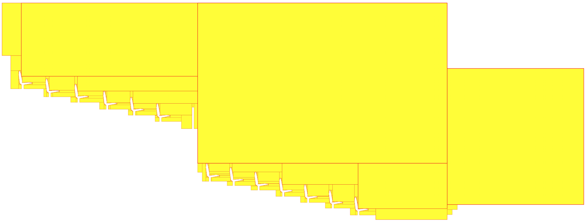

# Adaptive-Boxes

  

Python Library for rectangular decomposition of 2D binary images.

See also the ultra-fast CUDA GPU version: <a href="https://github.com/jnfran92/adaptive-boxes-gpu">adaptive-boxes-gpu</a>

## Quick Start

Install `adabox` from PiP:

    pip install adaptive-boxes
        

Call **adaptive-boxes** library

    from adabox import proc
    from adabox.plot_tools import plot_rectangles, plot_rectangles_only_lines

Call others too:

    import numpy as np
    import matplotlib.pyplot as plt
    
Load data in `.csv` format. File should contain data with columns: `[x1_position x2_position flag]`. 
Initially, `flag = 0` (See `sample_data` folder).

    
    # Input Path
    in_path = './sample_data/sample_2.csv'
    
    # Load Demo data with columns [x_position y_position flag]
    data_2d = np.loadtxt(in_path, delimiter=",")

If you want to see data, plot using:

    # Plot demo data
    plt.scatter(data_2d[:, 0], data_2d[:, 1])
    plt.axis('scaled')    
 
Decompose data in rectangles, it returns a list of rectangles and a separation value needed to plot them.

    rectangles = []
    # Number of random searches, more is better!
    searches = 2        
    (rectangles, sep_value) = proc.decompose(data_2d, searches)
    print('Number of rectangles found: ' + str(len(rectangles)))   
   

Plot resulting rectangles

    plot_rectangles(rectangles, sep_value)

or 

    plot_rectangles_only_lines(rectangles, sep_value) 

## Output

`Adabox` applied over: `./sample_data/` files. Click in the images to expand.

### Hi-res images

#### File: `sample_1.csv`

#### File: `sample_2.csv`

## Repo Content

Each folder contains the next information:

- data: Files with voxel information in Blender (`.ply` extension)
- proto: Prototype scripts
- results: Results of the heuristic process (`.json` extension)
- lib: library scripts
- postproc_gpu: post-processing scripts for handling csv files generated by adaptive-boxes-gpu.

## More info

